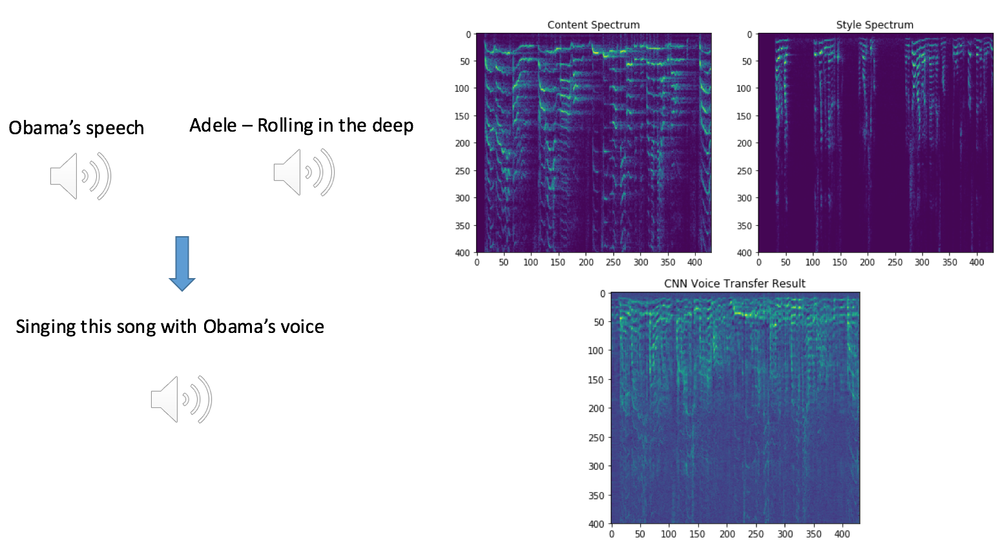
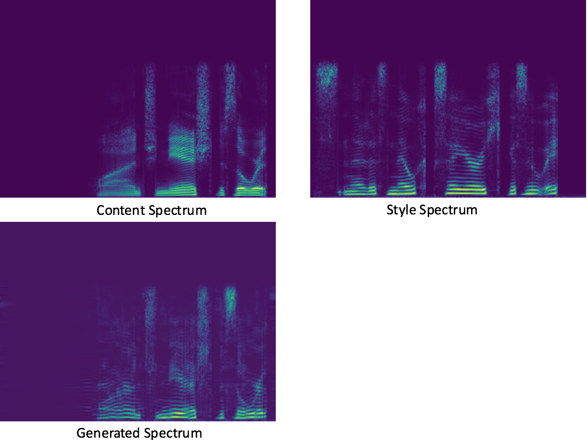

# Voice style transfer with random CNN
Maybe the fastest voice style transfer with reasonable result ?
## What is voice style transfer?
Inspired by the paper [A Neural Algorithm of Artistic Style](https://arxiv.org/abs/1508.06576) , the idea of `Neural Voice Transfer` aims at  "using Obama's voice to sing songs of Beyoncé" or something related.

We aim to:


## Highlight of my work
* Use **2-D CONV** rather than 1-D for audio spectrogram.
* Compute **grams over time-axis**.
* **Training fast**. 5-10 minutes to train and transfer on 1 single GPU(Tesla P40).
* **Do not need dataset!** You can transfer any 2 pieces of audio.(But some format of audio may occur error, then you should `sudo apt-get install libav-tools`)

## Performance compared with other works
Some of other projects with audio results are as below.
* [Dmitry Ulyanov: Audio texture synthesis and style transfer](https://dmitryulyanov.github.io/audio-texture-synthesis-and-style-transfer/): The first project of putting forward to use the shallow random CNN for voice transfer. However, the results in this URL is not so good, it sounds like **two voice mixed together**. I used his code on my `boy.wav` and `girl.wav` to generate audio, the result faces the same problem. You can hear the comparison at [Stairway2Nightcall](https://soundcloud.com/mazzzystar/sets/stairway2nightcall), the audio for comparison is downloaded from Dmitry Ulyanov's website.
* [Google style tranfer results](https://google.github.io/speech_style_transfer/samples.html). The paper is [On Using Backpropagation for Speech Texture Generation and Voice Conversion](https://arxiv.org/abs/1712.08363), the archicture is using 13 layers CONV + pre-trained CTC model. Our results sounds is comparable with theirs, you can hear it on [soundcloud.com](https://soundcloud.com/mazzzystar/sets)
* [Voice Style Transfer to Kate Winslet with deep neural networks](https://soundcloud.com/andabi/sets/voice-style-transfer-to-kate-winslet-with-deep-neural-networks). This project has the best results among all current works.(Maybe?) And the cost is:
	* **Heavy architecture.** We can see from it's [github repo](https://github.com/andabi/deep-voice-conversion) , the architecture is to training 2 networks, `Net1 classifier` and `Net2 synthesizer ` and combine them together
	* **Delicate dataset.** Except of using widely known dataset such as TIMIT, the author used the girls 2 hours audio dataset, and **1,000+ recording of <boy, girl> pairs audio speaking the same sentence**, that's maybe unacceptable in reality of training others voice.
    * **Not general.** The model was trained only for *Kate Winslet's* voice transfer. If we want to transfer to Obama's voice, we need to gather Obama's voice data and train that network again.


To sum up, our results is far better than the original `random CNN` results, which use the same dataset (only two audio) as we did. For those pre-trained deep neural network based on huge dataset, our results is comparable, and can be traind in 5 minutes, without using any outer dataset.(**But still, all these conclusion are based on human taste.**)

## Results
**You can listen to my current result  now !** It's on soundcloud, [link1](https://soundcloud.com/mazzzystar/sets/stairway2nightcall), [link2](https://soundcloud.com/mazzzystar/sets/speech-conversion-sample).

The generated spectrogram compared with `content` and `style`.


Compare the spectrogram of `gen` with `content` and `style`(X axis represents `Time Domain`, Y axis represents `Frequency Domain`),  we can find that:
* The structure is almost the same as `content`, and the **gap along frequency axis**, which determines the `voice texture` to a great extent, is more alike to the style.
* The base skeleton is **shifted upward a little bit** for being similar to the style(The style is girl's voice, which has higher frequency than boy's).

## Reproduce it yourself
```
python train.py
```
Tips: change `3x1` CONV to `3x3` CONV can get smoother generated spectrogram.

### But..does the `gram` of random CNN output really works ?
Below is my experiments result of using `texture gram`  after 1-layer RandomCNN  to capture speaker identity by putting them as **the only feature** in a simple nearest neighbor speaker identification system. The table shows the result of speaker identification accuracy of this system over the first 15 utterances of 30 first speakers of the VCTK dataset, along with 100 utterances of 4 first speakers.

| Speakers        | Train/Test           | Accuracy  |
| ------------- |:-------------:| -----:|
| 30     | 270/180 | 45.6%|
| 4      | 240/160      |   92.5% |

It seems `texture gram along time-axis` really captured something, you can check it by:
```
python vctk_identify
```
